# Daggerheart Tools — UML Class Diagram

Generated from source at version 1.1.1. Uses [Mermaid](https://mermaid.js.org/) syntax — render in GitHub, Obsidian (with Mermaid plugin), or any compatible viewer.

```mermaid
classDiagram

%% ─────────────────────────────────────────
%% OBSIDIAN BASE CLASSES (external)
%% ─────────────────────────────────────────
class Plugin {
    <<Obsidian>>
    +app: App
    +manifest: PluginManifest
    +onload()
    +onunload()
}

class Modal {
    <<Obsidian>>
    +app: App
    +contentEl: HTMLElement
    +onOpen()
    +onClose()
}

class MarkdownRenderChild {
    <<Obsidian>>
    +containerEl: HTMLElement
    +onload()
    +onunload()
}

class PluginSettingTab {
    <<Obsidian>>
    +app: App
    +plugin: Plugin
    +display()
    +hide()
}

class EditorSuggest {
    <<Obsidian>>
    +getSuggestions(ctx)
    +renderSuggestion(value, el)
    +selectSuggestion(value, evt)
    +onTrigger(cursor, editor, file)
}

class Component {
    <<Obsidian>>
}

%% ─────────────────────────────────────────
%% DOMAIN INTERFACES (types/)
%% ─────────────────────────────────────────
class CommonProps {
    <<interface>>
    +name: string
    +id: string
    +type?: string
    +saved?: boolean
    +note?: string
    +path?: string
    +mtime?: number
    +image?: string
    +alias?: string
    +extends?: string | string[]
    +text?: string
    +source?: string | string[]
}

class TieredProps {
    <<interface>>
    +tier?: number
}

class HealthProps {
    <<interface>>
    +hp: number
    +stress: number
}

class DifficultyProps {
    <<interface>>
    +difficulty?: number | string
}

class FeaturesProps {
    <<interface>>
    +feats: Feature[]
}

class Feature {
    <<interface>>
    +id: string
    +name: string
    +text: string
}

class AdversaryProps {
    <<interface>>
    +adversaryType: string
    +subtype?: string
    +motives_and_tactics?: string
    +thresholds?: string
    +atk?: string
    +attack?: string
    +range?: string
    +damage?: string
    +experience?: string
    +horde_count?: number
}

class Adversary {
    <<type>>
    CommonProps & AdversaryProps
    TieredProps & HealthProps
    DifficultyProps & FeaturesProps
}

class EnvironmentProps {
    <<interface>>
    +potential_adversaries?: string
    +impulses?: string
    +environmentType?: string
}

class Environment {
    <<type>>
    CommonProps & EnvironmentProps
    DifficultyProps & TieredProps & FeaturesProps
}

class Combatant {
    <<type>>
    CommonProps & HealthProps
    +parentId: string
    +maxHP: number
    +maxStress: number
}

class Encounter {
    <<interface>>
    +id: string
    +adversaries: EnemyCombatant[]
    +allies: AllyCombatant[]
    +environments: Environment[]
}

class AbilityProps {
    <<interface>>
    +domain?: string
    +recall?: number
}

class AbilityCard {
    <<type>>
    CommonProps & AbilityProps & FeaturesProps
}

class ImportBatch {
    <<interface>>
    +id: string
    +filename: string
    +importedAt: string
    +counts: object
}

class DaggerheartToolsSettings {
    <<interface>>
    +parseFrontmatter: boolean
    +adversaries: Adversary[]
    +encounters: Encounter[]
    +environments: Environment[]
    +abilityCards: AbilityCard[]
    +version: object
    +disableSRD: boolean
    +saved: boolean
    +importBatches: ImportBatch[]
}

%% ─────────────────────────────────────────
%% REPOSITORY LAYER (bestiary/repository.ts)
%% ─────────────────────────────────────────
class IRepository {
    <<interface>>
    +state: string
    +load()
    +find(filter) T
    +filter(filter) T[]
    +add(item: T)
    +addRange(items: T[])
    +update(key, item: T)
    +delete(filter)
    +deleteBySource(batchTag)
    +markCurrent()
    +markDirty()
    +save()
    +subscribe(callback) string
    +unsubscribe(id)
    +notify(on, item)
    +notifyRange(on, items)
    +exists(predicate) boolean
}

class Repository {
    <<abstract>>
    #_state: string
    #data: T[]
    #_plugin: DaggerheartToolsPlugin
    #_callbacks: Callback[]
    +subscribe(callback) string
    +unsubscribe(id)
    +notify(on, item)
    +notifyRange(on, items)
    +markDirty()
    +find(filter) T
    +filter(filter) T[]
    +exists(predicate) boolean
    +add(item)
    +addRange(items)
    +update(key, item)
    +delete(filter)
    +deleteBySource(batchTag)
    +save()*
    +load()*
}

class AdversaryRepository {
    +disableSRD: boolean
    +saved: boolean
    +save()
    +load()
}

class EnvironmentRepository {
    +disableSRD: boolean
    +saved: boolean
    +save()
    +load()
}

class EncounterRepository {
    +save()
    +load()
}

class AbilityCardRepository {
    +save()
    +load()
}

%% ─────────────────────────────────────────
%% BESTIARY (bestiary/bestiary.ts)
%% ─────────────────────────────────────────
class BestiaryClass {
    -#bestiary: Adversary[]
    -#local: Adversary[]
    -#resolved: boolean
    +enableSRD: boolean
    +initialize(plugin)
    +hasLocal(name) boolean
    +getLocal(name) Adversary
    +isLocal(name) boolean
    +size() number
    +get(name) Adversary
}

%% ─────────────────────────────────────────
%% PARSERS (parser/)
%% ─────────────────────────────────────────
class LinkStringifier {
    <<utility>>
    +WIKILINK: string$
    +MARKDOWN: string$
    +isAdversaryLink(link)$ boolean
    +replaceWikiLink(link)$ string
    +replaceMarkdownLink(link, alias?)$ string
    +transformSource(source)$ string
    +sanitizeYamlColonValues(source)$ string
    +transformYamlSource(source)$ string
    +stringifyLinks(source)$ string
}

class LinkifierClass {
    <<singleton>>
    -#cache: Map~string, string~
    +app?: App
    +metadataCache?: MetadataCache
    +buildCache()
    +getResolvedFile(input, context) object
    +initialize(metadataCache, app)
    +linkify(input, context?) string
    +transformSource(source) string
    +transformYamlSource(source) string
    +stringifyLinks(source) string
    +splitByLinks(text, context, render?) SplitLink[]
}

%% ─────────────────────────────────────────
%% API (api/api.ts)
%% ─────────────────────────────────────────
class Api {
    -#plugin: DaggerheartToolsPlugin
    +constructor(plugin)
    +getVersion() object
    +getBestiary() Map~string, Adversary~
    +getBestiaryCreatures() Adversary[]
    +getBestiaryNames() string[]
    +hasCreature(name) boolean
    +getSortedBy(field) Adversary[]
    +getIndices() string[]
    +isResolved() boolean
    +isStatblockLink(link) boolean
    +parseStatblockLink(link) string
    +stringifyLinks(source) string
    +transformLinks(source) string
    +renderMarkdown(markdown, el, sourcePath?, component?)
}

%% ─────────────────────────────────────────
%% MAIN PLUGIN (main.ts)
%% ─────────────────────────────────────────
class DaggerheartToolsPlugin {
    +settings: DaggerheartToolsSettings
    +api: Api
    +adversaries: AdversaryRepository
    +encounters: EncounterRepository
    +environments: EnvironmentRepository
    +abilityCards: AbilityCardRepository
    +onload()
    +onunload()
    +loadSettings()
    +saveSettings()
    +openModal(type, data, update?)
    +openAdversaryModal(adversary, update?)
    +openEnvironmentModal(environment, update?)
    +getFrontmatter(file?) object
    +writeFrontmatter(file?, key, value)
    +addNewAdversary(adversary)
    +updateAdversary(id, adversary)
    +deleteAdversary(id)
    +addNewEnvironment(environment)
    +updateEnvironment(id, environment)
    +deleteEnvironment(id)
    +addCombatant(encounterId, adversary)
    +removeCombatant(encounterId, combatantId)
    +updateCombatant(encounterId, combatant)
    +createEncounter() string
    +getEncounter(id) Encounter
    +checkDirtyEncounter(encounterId, adversary)
    +postprocessor(source, el, ctx)
    +environmentPostprocessor(source, el, ctx)
}

%% ─────────────────────────────────────────
%% SETTINGS TAB (settings/settings.ts)
%% ─────────────────────────────────────────
class DaggerheartToolsSettingsTab {
    +plugin: DaggerheartToolsPlugin
    +display()
    +hide()
}

%% ─────────────────────────────────────────
%% RENDERERS (view/)
%% ─────────────────────────────────────────
class AdversaryBlockRenderer {
    +container: HTMLElement
    +adversary: Adversary
    +plugin: DaggerheartToolsPlugin
    +params: Partial~AdversaryParameters~
    +context: string
    +encounter?: Encounter
    +icons: boolean
    +constructor(rendererParameters, icons?)
    +getAdversary(params)
    +build() Promise~Adversary~
    +transformLinks(monster) Partial~Adversary~
    +init()
}

class EnvironmentRenderer {
    +container: HTMLElement
    +environment: Environment
    +plugin: DaggerheartToolsPlugin
    +params: Partial~EnvironmentParameters~
    +context: string
    +icons: boolean
    +constructor(rendererParameters, icons?)
    +getEnvironment(params)
    +build() Promise~Environment~
    +transformLinks(env) Partial~Environment~
    +init()
}

%% ─────────────────────────────────────────
%% MODALS (view/)
%% ─────────────────────────────────────────
class AdversaryModal {
    +adversary?: Adversary
    +plugin: DaggerheartToolsPlugin
    +update: boolean
    +subscription?: string
    +onOpen()
    +onClose()
    +addAdversaryToDocument(item)
    +updateAdversaryToDocument(old, item)
}

class EnvironmentModal {
    +environment?: Environment
    +plugin: DaggerheartToolsPlugin
    +update: boolean
    +subscription?: string
    +onOpen()
    +onClose()
    +addEnvironmentToDocument(item)
    +updateEnvironmentToDocument(old, item)
}

class DaggerheartSelectModal {
    +plugin: DaggerheartToolsPlugin
    +onOpen()
    +onClose()
    +switchModal(modalType)
    +addObjectToDocument(name, type)
}

class SelectAdversaryModal {
    +plugin: DaggerheartToolsPlugin
    +onOpen()
    +onClose()
    +addAdversaryToDocument(item)
}

%% ─────────────────────────────────────────
%% SVELTE COMPONENTS (view/ — .svelte)
%% ─────────────────────────────────────────
class AdversaryBlock {
    <<Svelte Component>>
    +context: string
    +adversary: Adversary
    +plugin: DaggerheartToolsPlugin
    +renderer: AdversaryBlockRenderer
    +encounter: Encounter
    +blockConfiguration?: Map~string, boolean~
}

class AdversaryForm {
    <<Svelte Component>>
    +adversary?: Adversary
    +update: boolean
    +plugin: DaggerheartToolsPlugin
    -adversaryState: Adversary
    -errors: AdversaryErrorProps
    -features: Feature[]
    -hasErrors: boolean
    +addFeature()
    +addExperience()
    +onSubmit()
}

class EnvironmentBlock {
    <<Svelte Component>>
    +context: string
    +environment: Environment
    +plugin: DaggerheartToolsPlugin
    +blockType?: string
}

class EnvironmentForm {
    <<Svelte Component>>
    +environment?: Environment
    +update: boolean
    +plugin: DaggerheartToolsPlugin
    -environmentState: Environment
    -errors: EnvironmentErrorProps
    -features: Feature[]
    -hasErrors: boolean
    +addFeature()
    +onSubmit()
}

%% ─────────────────────────────────────────
%% SUGGESTER (util/suggester.ts)
%% ─────────────────────────────────────────
class AdversarySuggester {
    -_context: SuggestContext
    -_keys: string[]
    -_props: Map~string, CommonProps~
    +plugin: DaggerheartToolsPlugin
    +getSuggestions(ctx) string[]
    +renderSuggestion(text, el)
    +selectSuggestion(value, evt)
    +onTrigger(cursor, editor, file)
}

%% ─────────────────────────────────────────
%% INHERITANCE
%% ─────────────────────────────────────────
Plugin <|-- DaggerheartToolsPlugin
Modal <|-- AdversaryModal
Modal <|-- EnvironmentModal
Modal <|-- DaggerheartSelectModal
Modal <|-- SelectAdversaryModal
MarkdownRenderChild <|-- AdversaryBlockRenderer
MarkdownRenderChild <|-- EnvironmentRenderer
PluginSettingTab <|-- DaggerheartToolsSettingsTab
EditorSuggest <|-- AdversarySuggester
Component <|-- LinkifierClass
IRepository <|.. Repository
Repository <|-- AdversaryRepository
Repository <|-- EnvironmentRepository
Repository <|-- EncounterRepository
Repository <|-- AbilityCardRepository

%% ─────────────────────────────────────────
%% COMPOSITION / OWNERSHIP (plugin owns these)
%% ─────────────────────────────────────────
DaggerheartToolsPlugin "1" *-- "1" Api : api
DaggerheartToolsPlugin "1" *-- "1" AdversaryRepository : adversaries
DaggerheartToolsPlugin "1" *-- "1" EnvironmentRepository : environments
DaggerheartToolsPlugin "1" *-- "1" EncounterRepository : encounters
DaggerheartToolsPlugin "1" *-- "1" AbilityCardRepository : abilityCards
DaggerheartToolsPlugin "1" *-- "1" DaggerheartToolsSettingsTab : settingsTab
DaggerheartToolsPlugin "1" ..> BestiaryClass : uses (singleton)
DaggerheartToolsPlugin "1" ..> LinkifierClass : uses (singleton)

%% ─────────────────────────────────────────
%% RENDERER DEPENDENCIES
%% ─────────────────────────────────────────
AdversaryBlockRenderer "1" ..> LinkStringifier : transformSource()
AdversaryBlockRenderer "1" ..> LinkifierClass : transformSource()
AdversaryBlockRenderer "1" ..> AdversaryBlock : mounts
AdversaryBlockRenderer "1" --> DaggerheartToolsPlugin : plugin
EnvironmentRenderer "1" ..> LinkStringifier : transformSource()
EnvironmentRenderer "1" ..> LinkifierClass : transformSource()
EnvironmentRenderer "1" ..> EnvironmentBlock : mounts
EnvironmentRenderer "1" --> DaggerheartToolsPlugin : plugin

%% ─────────────────────────────────────────
%% MODAL DEPENDENCIES
%% ─────────────────────────────────────────
AdversaryModal "1" ..> AdversaryForm : mounts
AdversaryModal "1" --> DaggerheartToolsPlugin : plugin
EnvironmentModal "1" ..> EnvironmentForm : mounts
EnvironmentModal "1" --> DaggerheartToolsPlugin : plugin
DaggerheartSelectModal "1" --> DaggerheartToolsPlugin : plugin
SelectAdversaryModal "1" --> DaggerheartToolsPlugin : plugin

%% ─────────────────────────────────────────
%% API DEPENDENCY
%% ─────────────────────────────────────────
Api "1" --> DaggerheartToolsPlugin : #plugin
Api "1" ..> BestiaryClass : getBestiary()

%% ─────────────────────────────────────────
%% SETTINGS
%% ─────────────────────────────────────────
DaggerheartToolsSettings "1" *-- "*" ImportBatch : importBatches
DaggerheartToolsPlugin "1" *-- "1" DaggerheartToolsSettings : settings

%% ─────────────────────────────────────────
%% DOMAIN TYPE COMPOSITION
%% ─────────────────────────────────────────
Adversary ..> CommonProps : includes
Adversary ..> AdversaryProps : includes
Adversary ..> TieredProps : includes
Adversary ..> HealthProps : includes
Adversary ..> DifficultyProps : includes
Adversary ..> FeaturesProps : includes
Environment ..> CommonProps : includes
Environment ..> EnvironmentProps : includes
Environment ..> DifficultyProps : includes
Environment ..> TieredProps : includes
Environment ..> FeaturesProps : includes
FeaturesProps ..> Feature : feats[]
AbilityCard ..> CommonProps : includes
AbilityCard ..> AbilityProps : includes
AbilityCard ..> FeaturesProps : includes
Combatant ..> CommonProps : includes
Combatant ..> HealthProps : includes
Encounter ..> Combatant : adversaries/allies
Encounter ..> Environment : environments

%% ─────────────────────────────────────────
%% REPOSITORY ↔ DOMAIN TYPES
%% ─────────────────────────────────────────
AdversaryRepository ..> Adversary : T
EnvironmentRepository ..> Environment : T
EncounterRepository ..> Encounter : T
AbilityCardRepository ..> AbilityCard : T

%% ─────────────────────────────────────────
%% SUGGESTER
%% ─────────────────────────────────────────
AdversarySuggester --> DaggerheartToolsPlugin : plugin
```

